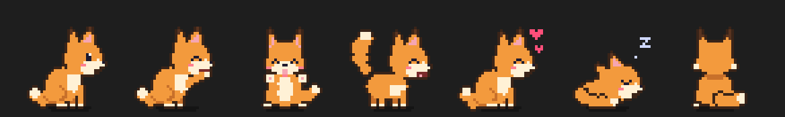
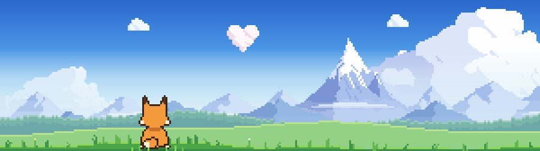

# Foxel

A cute pixel-art fox cub that lives in your editor.

It is a pet, not a tool. It lives by your clock, has its moods and its needs, and there is not a word, a number or a gauge in its view: you read how it feels from what it does.

## Getting started

After installing, open the **Foxel** tab in the bottom panel. The panel gives it the most room to run. If you prefer the side bar, set `foxel.position` to `explorer`.

## A few things to try

- Move your pointer into its view, and leave it resting on the fox for a moment.
- Hold the mouse button down and stroke it.
- Click it, here and there. It does not react the same way everywhere.
- Double-click an empty spot, then pick up what appears and throw it.
- Keep it company through a whole day of work, from early morning to late at night.

That is all this page will tell you. The rest is yours to find: it has more habits, games and surprises than fit in a list, and some of them only come once in a long while.

## Commands

- **Foxel: Show Companion** / **Hide Companion** / **Toggle Companion**
- **Foxel: Throw a Ball**
- **Foxel: Blow Bubbles**
- **Foxel: Give a Treat**
- **Foxel: Fill the Bowl**
- **Foxel: Say Hello**

## Settings

| Setting | Default | Description |
| --- | --- | --- |
| `foxel.enabled` | `true` | Show the companion |
| `foxel.position` | `panel` | `panel`, `explorer`, or `editor` for a strip of its own under your files |
| `foxel.scale` | `4` | Size of one sprite pixel, in screen pixels |
| `foxel.speed` | `1` | Animation speed multiplier |
| `foxel.coat` | `red` | Fur colour: `red`, `arctic`, `silver` or `fennec` |
| `foxel.reactToTyping` | `true` | Tap along when you type |
| `foxel.reactToErrors` | `true` | React to errors appearing and being fixed |
| `foxel.sleepAfterSeconds` | `300` | Inactivity before it falls asleep |
| `foxel.name` | `""` | Your fox's name, shown as the title of its view |
| `foxel.dayNight` | `true` | Live by the local clock: greetings, light, bedtime, party days |
| `foxel.meals` | `true` | Get hungry at meal times |
| `foxel.breakReminderMinutes` | `50` | Minutes of work before it asks for a break, `0` = off |
| `foxel.hydrationReminderMinutes` | `60` | Minutes between drinks, `0` = off |

## Privacy

Foxel collects no telemetry and makes no network requests. It only counts the number of errors and listens to editor events to pick its reactions. It never reads or stores your code.

---

Made with ❤️ by anca.
